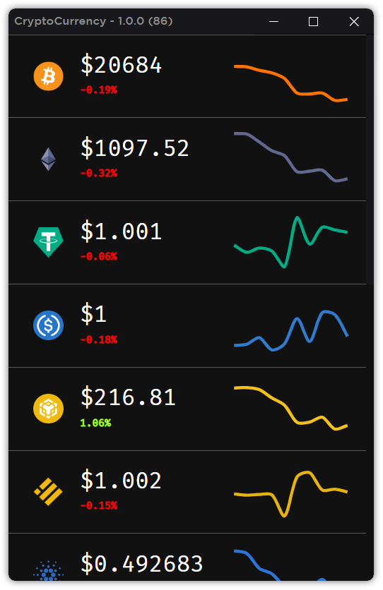
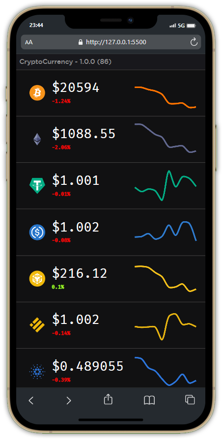
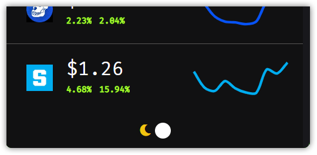

**Made by ElThomas ❤️ in France**

➡️ The desktop application: ``Cryptocurrency App``, is an interface to help trading on the crypto market in real time. With the most popular cryptos in real time, a graph of the last 7 days for each crypto. And a bullish or bearish indicator for the coin (24h and 7d). Moreover there is a dark and light mode ^^


CryptoCurrency Desktop App use:
- ElectronJs
- CoinGecko API
- Bootstrap
- React.js
- Chart.js

Run the code:
```
npm install
npm start
```

### Demo Beta App Desktop and Phone (Iphone 12 PRO MAX)



### Dark and Light mode


|!| package.json >> ```script: {"start": "electron ."}``` |!|
